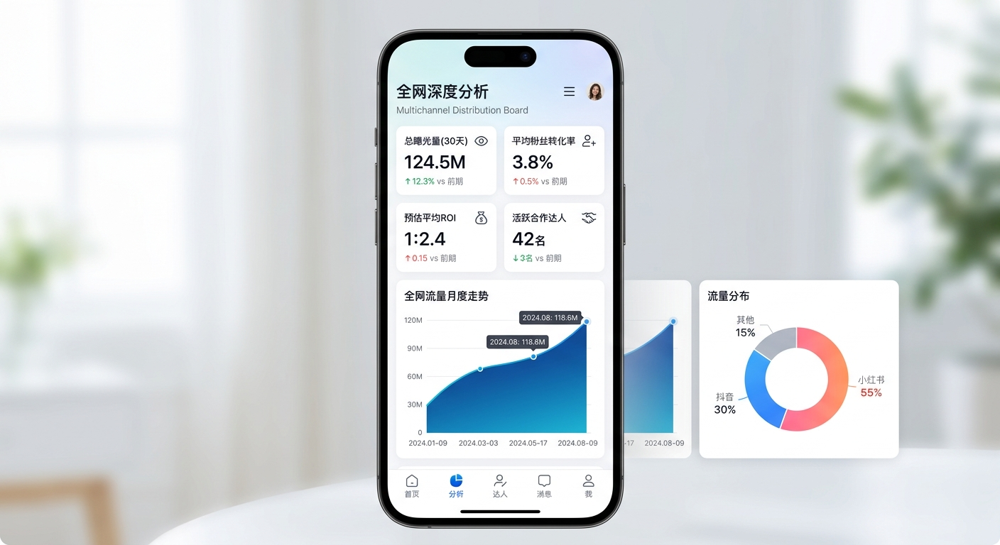
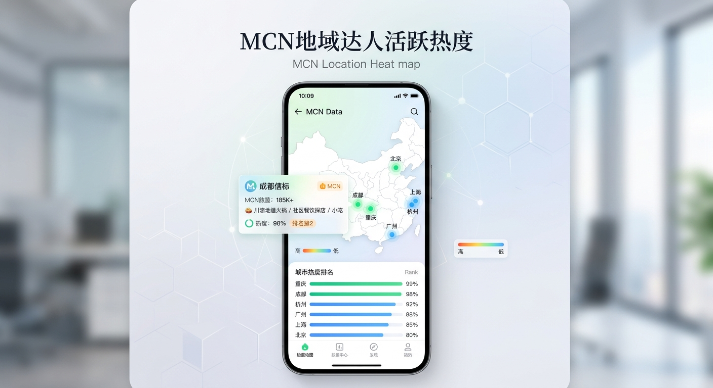
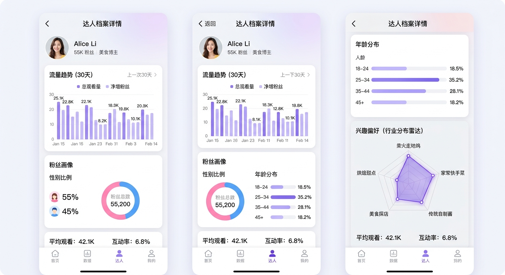
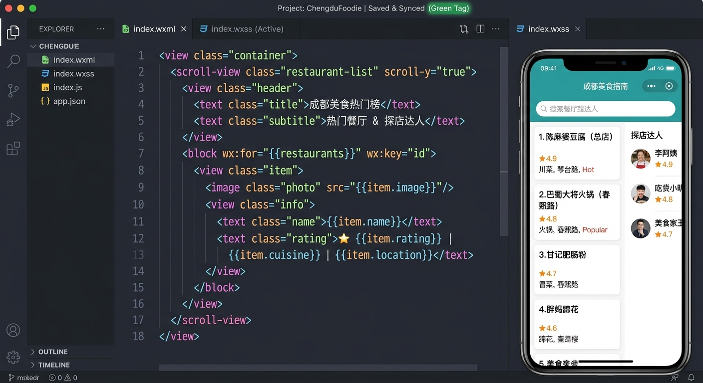

# 达人情报局：全端品牌营销与餐饮达人决策分析系统

「达人情报局」是一款专为 MCN 机构、品牌方及自媒体运营主理人打造的智能达人决策与数据分析系统。系统结合多平台数据接口，针对抖音（Douyin）与小红书（Xiaohongshu）两大核心平台提供全方位的达人画像、行业赛道分析、AI 爆款测试以及面向微信小程序的代码级实时同步，赋能决策流。

本期更新特别推出 **「餐饮行业专属模式」**，深耕川渝热辣老饕地与江南精致料理商圈。

---

## 📸 核心界面功能展示与说明

### 1. 达人智能探索与「餐饮行业专属模式」

*   **双平台无缝切换**：一键切换抖音（Douyin）与小红书（Xiaohongshu），动态重新获取平台定制化特色指标。
*   **餐饮专区专属模式（🌶️ 已开启）**：打开餐饮专属功能后，系统自动触发地理位置聚合策略，过滤非美食生活类的其他杂乱达人，仅保留以**川湘火锅、市井江湖菜、精致杭帮菜、街头大排档、美食吃播、探店博主**为主体的精细化垂类面貌。
*   **核心商圈定位切换**：内置 **成都、重庆、杭州** 三地大盘快切标签。点击即可快速筛选核心地带的优质高潜探店博主（例如：通过 AI 增长引擎筛选出高增长的 `@蜀中桃子姐`，获取 +84% 环比增长的增长透视状态）。
*   **AI 智能诊断输入**：支持在输入框内输入任意达人姓名、ID 或细分关键词，一键连通后台分析模块，抓取数据并自动回填到当前数据库中。

---

### 2. 全网多维维度深度分析大盘 (Multichannel Analytics)

*   **全大盘指标聚合 (KPI)**：直观追踪 **总曝光量 (30天)、平均粉丝转化率、预估平均 ROI、活跃合作达人总数** 四大核心关键指标，并提供环比升降标识。
*   **流量涨落波形走势**：引入平滑的折线阴影面积图，精确描绘最近30天全网整体流量日度潮汐走向，为商业推广投放、排期策略提供有力参照。
*   **社媒合作生态分布**：结合炫彩极简环形饼图，动态展示抖音、小红书、哔哩哔哩及其他长短视频平台的合作占位数比例。

---

### 3. MCN 地域达人活跃热力地图 (Location GIS Heatmap)

*   **地理坐标网格渲染**：内置高度美观、带经纬度坐标与微光呼吸视效的中国核心达人热力地图，点击可点亮的 **北京、上海、杭州、成都、重庆、广州** 六大核心地标气泡。
*   **双向交互与下钻分析**：
    *   **在主界面地图上点击任意地标**，系统在下方立刻弹出对应该城市的下钻报告（例如点击 **【成都】**，可查看其 MCN 数量达 185K+、主力赛道为“川渝地道火锅 / 社区餐饮探店 / 小吃”、当前热度达 98% 排名全国第 2 的情报摘要，并且**系统左侧达人推荐列表将同步下钻到该城市餐饮专属结果**）。
    *   **在下方排行版点击**，即可联动渲染定位地图中的闪烁视圈。
*   **全国活跃度排名纵览**：右下角提供直观的城市热度排名柱状图，实时更新。

---

### 4. 精细化达人档案与 AI 忠诚潜力透视 (Creator Details)

*   **30天精细曝光流向**：通过温和的渐变紫色柱状图，追踪每一个博主的个人单天曝光波动，掌握其内容生命周期。
*   **精准受众画像 (Demographics)**：
    *   **性别天平**：直观展示博主的粉丝男女粉丝比重。
    *   **年龄阶梯**：划分博主粉丝在 18-24 岁、25-34 岁、35-44 岁三个最火购买力黄金年龄层的分布比重。
*   **兴趣偏好 TGI 雷达 (Radar Chart)**：基于其视频高频常现词、内容词云，利用五维度雷达空间建模，描绘达人的专属标签。如在餐饮博主身上勾勒出：`柴火走地鸡`、`传统自制酱`、`家常快手菜` 等重合率，让品牌选号更科学、文案投放更精准。

---

### 5. 微信小程序实时开发者 IDE 联动工具 (Mini Program IDE)

*   **原生代码热编辑编辑器**：系统在左侧完整提供了仿制专业开发者 IDE 的编辑器，可直接查阅、编写对应微信小程序中 `app.json`、`app.js`、`app.wxss` 及各大子页面 (.wxml, .js, .wxss, .json) 源文件。
*   **物理磁盘硬件级联动**：包含真实的 Express 数据写入网关。用户在 IDE 中点击 **「保存修改并同步」** 按钮，该代码将实打实地物理同步并保存写入到服务器本工程根目录下的 `/miniprogram` 中！
*   **100% 官方规范，即下即编译**：该文件夹内的小程序架构 100% 纯原生且严苛遵循微信官方语法。从本工程中将其导出、或使用微信开发者工具加载这一文件夹，即可将其一键导入，直接编译运行在真实的测试手机小程序中，极速联通全端。

---

## 🎨 系统视觉与设计规范

1.  **极智科技色盘 (Cyber Charcoal & Warm Amber)**：
    *   使用深邃、高饱和的科技白作基底，搭配纯正高对比度的靛蓝（`indigo-600`）和落霞橙（`orange-500`）提供强烈的情感温差与精美点缀。
    *   针对餐饮行业的特殊性，全链路引入朝气蓬勃、富有食欲感的琥珀黄与暖橙渐变，一改机器冷酷外表，呈现暖色科技温度。
2.  **优雅的空间对称 (Layout & Rhythm)**：
    *   页面采用卡片包结构与优雅的负空间（Negative Space）留白。
    *   使用来自 `lucide-react` 精致一致的微图标系统，搭配 `motion/react` 库提供舒适、平滑且带有适度阻尼感（Damping）的过渡、卡片悬浮、及下钻呼吸动效。
