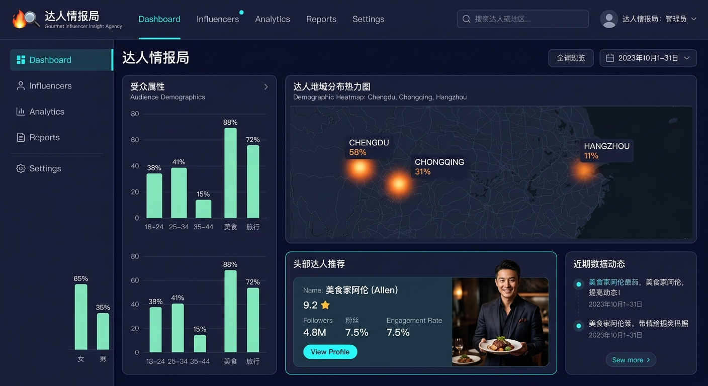

# 达人情报局：全端品牌营销与达人决策分析系统

「达人情报局」是一款专为 MCN色机构、品牌方及自媒体运营主理人打造的智能达人决策与数据分析系统。系统结合多平台数据接口，针对抖音（Douyin）与小红书（Xiaohongshu）两大核心平台提供全方位的达人画像、行业赛道分析、AI 爆款测试以及面向微信小程序的代码级同步同步，赋能决策流。

---

## 🚀 核心功能模块

### 1. 达人探索与实时大盘 (Explore & Discover)
*   **双平台自由切换**：支持抖音与小红书平台的一键无缝转换，获取定制化的平台数据侧写。
*   **智能 AI 达人搜索**：提供深度的语义分析，一键搜索对应行业、特性以及风格的达人并生成深度分析。
*   **地域达人分布热力图**：根据达人常驻区域，实时绘制可视化热力地图，支持人群包精准触达。
*   **成长新星预测**：通过 AI 增长引擎模型，发掘流量环比增长超 80% 的高互动率高潜力黑马。
*   **实时热度榜单**：高精度的达人实时增长排行，细分垂类，辅助精准抢占黄金曝光期。

### 2. 达人精细化画像与 AI 潜力透视 (Creator Demographics)
*   **关键指标 (KPI)**：聚合展示粉丝量、高客多维互动率、平均赞藏数据。
*   **品牌契合量化 (Brand Fit)**：自动生成品牌心智契合度评分（如 90+ 极佳匹配），辅助商业选品。
*   **AI 潜力三维评估**：爆火概率、转化潜力以及粉丝忠诚度的多维长条走势。
*   **多维可视化组件**：
    *   **流量曝光趋势**（30天柱状起伏图）
    *   **粉丝属性分布**（精准的男女性比例与 age18-44 梯队群组占比）
    *   **兴趣偏好雷达**（智能硬件、美妆、时尚等雷达空间建模）

### 3. 行业赛道数据分析室 (Analytics Room)
*   **垂直赛道监控**：美妆个护、数码科技、时尚穿搭、美食探店、萌宠逗趣五大王牌赛道自由下拉切换。
*   **大盘中位数指数**：实时追踪本赛道活跃达人库总数，以及行业级中位数平均互动率。
*   **主推赛道曝光分布**：直观展示行业细分内容（如“硬件评测”、“可折叠屏幕”）所占的真实曝光权重。

### 4. AI 爆款实验室 (AI Lab)
*   **标题潜在点击率 (CTR) 推测**：直接输入内容标题，AI 模型实时计算并返回对应的爆款概率分值。
*   **精细化指标**：预测预计点击率范围，结合历史优质文案库。
*   **深度优化方案**：由 AI 提供极具转化张力的结构化优化话术（例如：增强数字张力、设置悬念、强化目标受众痛点等建议）。

### 5. 微信小程序实时开发者 IDE 工具 (Mini Program IDE & Filesystem Sync)
*   「达人情报局」首创集成了原生**代码热编辑 IDE 控件**。
*   **真实磁盘硬件级联动**：在页面左侧代码查看与编辑器中，直接编辑包含 `app.json`、`app.js`、`app.wxss` 以及各页面路径下（Discover, Profile, Analytics, AILab, Mine）的 `.wxml`、`.js`、`.wxss` 和 `.json` 源代码，点击 **“保存修改并同步”** 即可通过后台 Express服务实时物理写入项目根目录下的 `/miniprogram` 文件夹。
*   **无损转化与即开即用**：该文件夹下的所有代码 100% 严格遵循微信官方小程序标准语法。用户从该文件夹中导出代码即可直接加载在「微信开发者工具」中完美编译运行该款原汁原味的手机小程序。

---

## 🎨 视觉系统与 UI 设计规范

本系统在界面交互和视觉传达上追求极致专业的“未来极客”与“极简人文”交织的设计风格。

1.  **极智色盘 (Cyber Indigo & Cosmic Slate)**：
    *   引入深靛蓝（`indigo-950/90`）与暗瓦灰（`slate-950`）作为底层容器架构主基调，创造低照度、防眩光且极具沉浸感的编译空间。
    *   使用薄荷青（`cyan-400`）、翡翠绿（`emerald-400`）和琥珀黄（`amber-500`）等高饱和、强对比微透光亮色调作为状态、交互以及代码语法的核心标识。
2.  **空间韵律与排版比例 (Layout & Spacing)**：
    *   **一语直达**：主搜索区提供无遮挡的大字显示标题与操作模块，辅以平滑舒缓的入场过渡动效。
    *   **全响应式多端自适应布局**：支持大屏幕的经典多列仪表，同时在移动端及微信环境中无缝坍塌成单栏信息流。
    *   在卡片的边缘、悬浮反馈及按钮操作上，应用多层温和交叠的暗色微投影饰边，保持界面极高的纯粹感与层次张力。
